# PhonePe Digital Payment Analytics Dashboard

## 📋 Table of Contents

- [📊 Project Overview](#-project-overview)
- [🎯 Problem Statement](#-problem-statement)
- [🚀 Features](#-features)
  - [Streamlit Dashboard](#streamlit-dashboard)
  - [Power BI Dashboard](#power-bi-dashboard)
- [📁 Project Structure](#-project-structure)
- [🛠️ Technology Stack](#️-technology-stack)
  - [Streamlit Application](#streamlit-application)
  - [Power BI Dashboard](#power-bi-dashboard-1)
  - [Data Processing](#data-processing)
- [📋 Prerequisites](#-prerequisites)
- [🔧 Installation & Setup](#-installation--setup)
  - [Streamlit Dashboard](#streamlit-dashboard-1)
  - [Power BI Dashboard](#power-bi-dashboard-2)
- [📊 Data Sources](#-data-sources)
- [🔍 Key Insights & Analytics](#-key-insights--analytics)
  - [Transaction Analytics](#transaction-analytics)
  - [Geographical Analysis](#geographical-analysis)
  - [User Behavior](#user-behavior)
- [📈 Dashboard Features](#-dashboard-features)
  - [Streamlit Dashboard Pages](#streamlit-dashboard-pages)
  - [Power BI Dashboard Tabs](#power-bi-dashboard-tabs)
- [🚀 Usage Examples](#-usage-examples)
  - [Streamlit Dashboard](#streamlit-dashboard-2)
  - [Power BI Calculations](#power-bi-calculations)
- [🔧 Customization](#-customization)
  - [Adding New Visualizations](#adding-new-visualizations)
  - [Data Source Integration](#data-source-integration)
- [📱 Mobile Compatibility](#-mobile-compatibility)
- [🤝 Contributing](#-contributing)
- [📄 License](#-license)
- [👥 Authors](#-authors)
- [🙏 Acknowledgments](#-acknowledgments)
- [📞 Support](#-support)
- [🖼️ Screenshots & Visualizations](#️-screenshots--visualizations)
  - [Streamlit Dashboard Screenshots](#streamlit-dashboard-screenshots)
  - [Power BI Dashboard Screenshots](#power-bi-dashboard-screenshots)
  - [Data Analysis Visualizations](#data-analysis-visualizations)
- [🔮 Future Enhancements](#-future-enhancements)

---

## 📊 Project Overview

This project provides comprehensive analysis and visualization of PhonePe digital payment ecosystem data, focusing on transaction dynamics, user engagement patterns, and insurance-related metrics. The analysis helps understand payment trends across different geographical regions and categories to improve services and enhance user targeting strategies.

## 🎯 Problem Statement

With the increasing reliance on digital payment systems like PhonePe, understanding the dynamics of transactions, user engagement, and insurance-related data is crucial for improving services and targeting users effectively. This project aims to:

- Analyze and visualize aggregated values of payment categories
- Create interactive maps for total transaction values at state and district levels
- Identify top-performing states, districts, and pin codes
- Provide insights into user behavior and transaction patterns

## 🚀 Features

### Streamlit Dashboard
- **Interactive Data Visualization**: Dynamic charts and graphs for transaction analysis
- **Geographical Mapping**: State and district-wise transaction value visualization
- **Category Analysis**: Breakdown of payment categories and their performance
- **Top Performers**: Identification of leading states, districts, and pin codes
- **Real-time Filtering**: Interactive filters for time periods, regions, and categories
- **User Engagement Metrics**: Analysis of user behavior patterns

### Power BI Dashboard
- **Executive Summary**: High-level KPIs and business metrics
- **Trend Analysis**: Time-series analysis of transaction volumes and values
- **Comparative Analysis**: Performance comparison across regions
- **Insurance Analytics**: Dedicated views for insurance-related data
- **Mobile-Responsive Design**: Optimized for various device sizes

## 📁 Project Structure

```
phonepe-analytics/
│
├── data/
│   ├── raw/                    # Raw data files
│   ├── processed/              # Cleaned and processed data
│   └── external/               # External reference data
│
├── streamlit_app/
│   ├── app.py                  # Main Streamlit application
│   ├── pages/                  # Multi-page application structure
│   ├── components/             # Reusable UI components
│   └── utils/                  # Utility functions
│
├── powerbi/
│   ├── dashboard.pbix          # Power BI dashboard file
│   ├── data_model.png          # Data model screenshot
│   └── reports/                # Exported reports
│
├── scripts/
│   ├── data_preprocessing.py   # Data cleaning and preparation
│   ├── analysis.py             # Statistical analysis functions
│   └── visualizations.py       # Custom visualization functions
│
├── requirements.txt            # Python dependencies
├── config.yaml                 # Configuration settings
└── README.md                   # Project documentation
```

## 🛠️ Technology Stack

### Streamlit Application
- **Python 3.8+**
- **Streamlit**: Web application framework
- **Pandas**: Data manipulation and analysis
- **NumPy**: Numerical computations
- **Plotly**: Interactive visualizations
- **Folium**: Geographical mapping
- **Streamlit-Folium**: Folium integration for Streamlit

### Power BI Dashboard
- **Power BI Desktop**: Dashboard development
- **DAX**: Data Analysis Expressions for calculations
- **Power Query**: Data transformation and modeling

### Data Processing
- **Python**: Primary programming language
- **Pandas**: Data manipulation
- **NumPy**: Numerical analysis
- **Matplotlib/Seaborn**: Static visualizations

## 📋 Prerequisites

- Python 3.8 or higher
- Power BI Desktop (for Power BI dashboard)
- Git (for version control)
- 4GB+ RAM recommended

## 🔧 Installation & Setup

### Streamlit Dashboard

1. **Clone the repository**
   ```bash
   git clone https://github.com/PhonePe/pulse
   cd phonepe-analytics
   ```

2. **Create virtual environment**
   ```bash
   python -m venv venv
   source venv/bin/activate  # On Windows: venv\Scripts\activate
   ```

3. **Install dependencies**
   ```bash
   pip install -r requirements.txt
   ```

4. **Run the Streamlit application**
   ```bash
   streamlit run streamlit_app/app.py
   ```

5. **Access the dashboard**
   Open your browser and navigate to `http://localhost:8501`

### Power BI Dashboard

1. **Install Power BI Desktop**
   Download from [Microsoft Power BI](https://powerbi.microsoft.com/desktop/)

2. **Open the dashboard**
   - Launch Power BI Desktop
   - Open `powerbi/dashboard.pbix`
   - Refresh data connections if needed

## 📊 Data Sources

The project utilizes aggregated and anonymized PhonePe transaction data including:

- **Transaction Data**: Payment volumes, values, and categories
- **Geographical Data**: State, district, and pin code information
- **User Engagement**: User behavior and interaction metrics
- **Insurance Data**: Insurance-related transaction information
- **Temporal Data**: Time-series transaction patterns

## 🔍 Key Insights & Analytics

### Transaction Analytics
- Payment category performance analysis
- Seasonal trends and patterns
- Growth rate calculations
- Volume vs. value correlations

### Geographical Analysis
- State-wise transaction distribution
- District-level performance mapping
- Pin code hotspot identification
- Urban vs. rural transaction patterns

### User Behavior
- Engagement pattern analysis
- User segmentation insights
- Retention and acquisition metrics
- Device and platform preferences

## 📈 Dashboard Features

### Streamlit Dashboard Pages
1. **Overview**: Executive summary and key metrics
2. **Geographical Analysis**: Interactive maps and regional insights
3. **Transaction Trends**: Time-series analysis and forecasting
4. **Category Performance**: Payment category breakdowns
5. **Top Performers**: Leading regions and metrics
6. **User Analytics**: User behavior and engagement analysis

### Power BI Dashboard Tabs
1. **Executive Summary**: High-level KPIs and business metrics
2. **Trend Analysis**: Historical and predictive analytics
3. **Performance Comparison**: Comparative analysis tools
4. **Insurance Analytics**: Insurance-specific insights

## 🚀 Usage Examples

### Streamlit Dashboard
```python
# Example: Filtering data by state
selected_state = st.selectbox("Select State", states_list)
filtered_data = df[df['state'] == selected_state]

# Example: Creating interactive map
map_data = create_choropleth_map(filtered_data)
st.plotly_chart(map_data)
```

### Power BI Calculations
```dax
// Example: Calculate transaction growth rate
Transaction Growth = 
DIVIDE(
    [Current Period Transactions] - [Previous Period Transactions],
    [Previous Period Transactions]
) * 100
```

## 🔧 Customization

### Adding New Visualizations
1. Create new functions in `scripts/visualizations.py`
2. Import and use in Streamlit pages
3. Update Power BI with new measures and visuals

### Data Source Integration
1. Update data preprocessing scripts
2. Modify data loading functions
3. Update both dashboards with new data connections

## 📱 Mobile Compatibility

- **Streamlit**: Responsive design adapts to mobile screens
- **Power BI**: Mobile app compatibility and responsive layouts

## 🤝 Contributing

1. Fork the repository
2. Create a feature branch (`git checkout -b feature/AmazingFeature`)
3. Commit your changes (`git commit -m 'Add some AmazingFeature'`)
4. Push to the branch (`git push origin feature/AmazingFeature`)
5. Open a Pull Request

## 📄 License

This project is licensed under the MIT License - see the [LICENSE](LICENSE) file for details.

## 👥 Author

- **BALAJI K** - [YourGitHub](https://github.com/Balaji-itz-me)

## 🙏 Acknowledgments

- PhonePe for providing the dataset
- Streamlit community for excellent documentation
- Microsoft Power BI team for powerful analytics tools
- Open source contributors for various libraries used

## 📞 Support

For support and questions:
- Create an issue on GitHub
- Email: balajikamaraj99@gmail.com
- LinkedIn: [Your LinkedIn Profile](https://www.linkedin.com/in/balaji-k-626613157/)

## 🖼️ Screenshots & Visualizations

This section showcases the various visualizations and dashboards created for different business cases using Pandas, Streamlit, and Power BI.

### Streamlit Dashboard Screenshots

#### Main Dashboard Overview
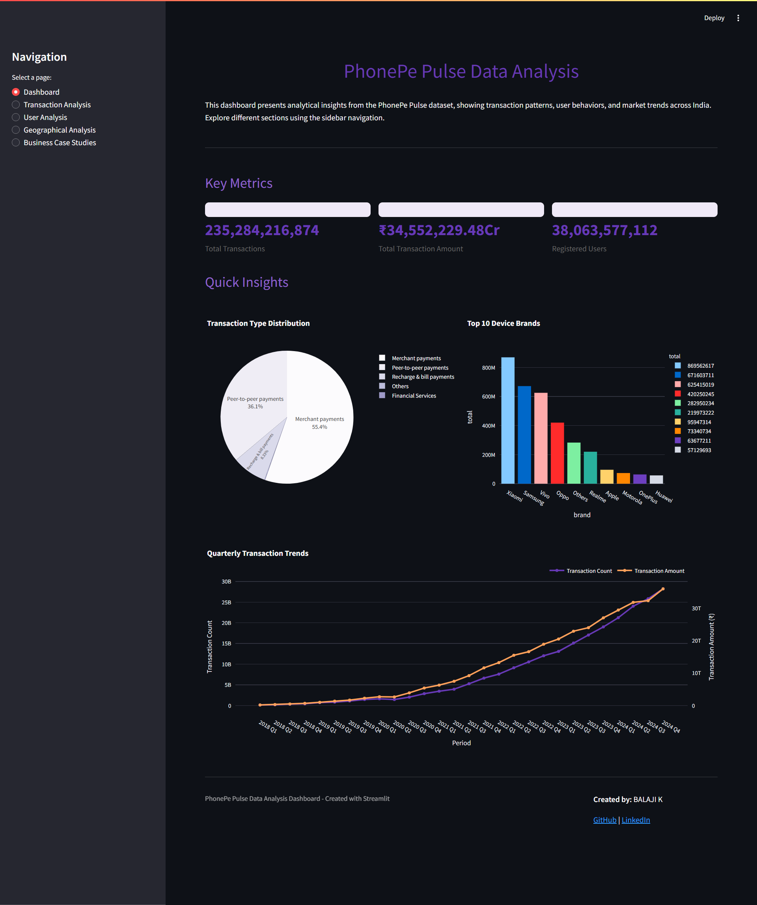
*Main dashboard showing key metrics and navigation*

#### Geographical Analysis
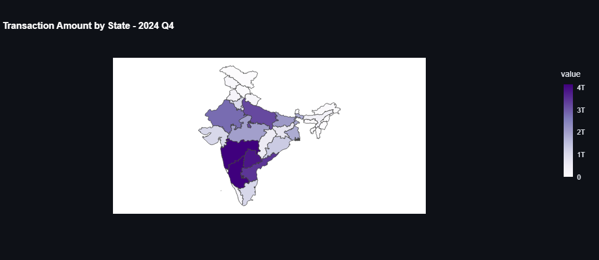
*Interactive map displaying state-wise transaction volumes*

#### Transaction Trends
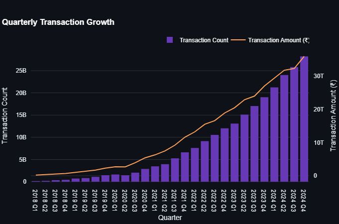
*Time-series analysis of transaction volumes and patterns*

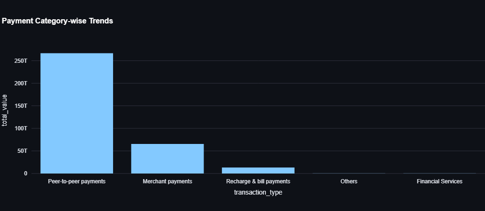
*Payment category performance breakdown*

#### Top Performers Dashboard
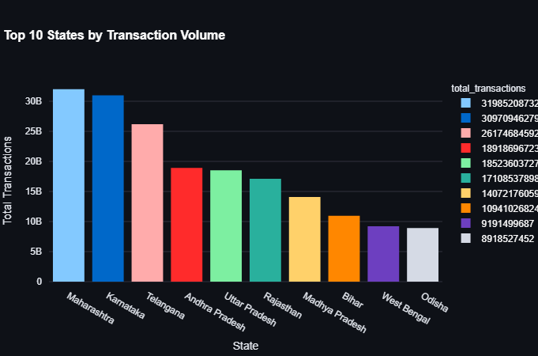
*Ranking of top-performing states by transaction volume*

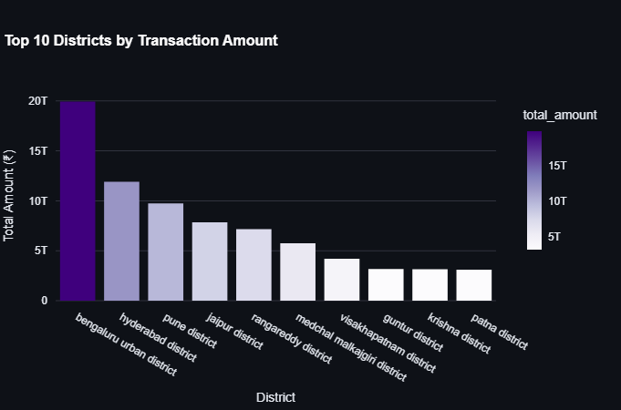
*District-wise performance metrics and comparisons*

### Power BI Dashboard Screenshots

#### Executive Summary
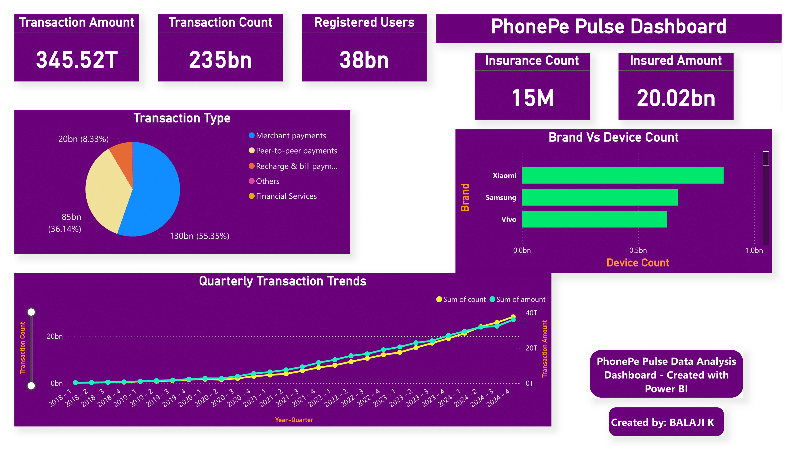
*High-level KPIs and business metrics overview*

#### Geographic Insights

*Interactive geographical analysis with drill-down features*


*Comparative analysis across different regions*

#### Trend Analysis

*Historical transaction trends and forecasting*


*Seasonal transaction pattern analysis*

#### Insurance Analytics
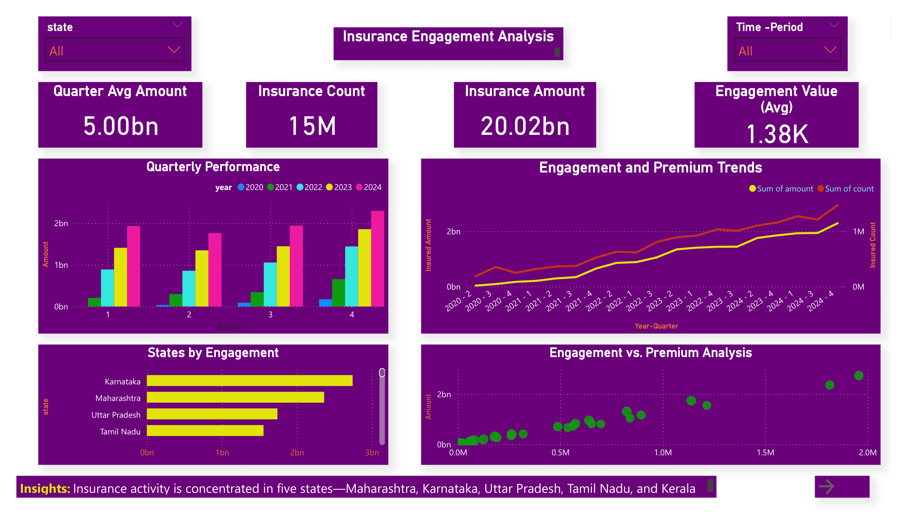
*Dedicated insurance transaction analysis dashboard*

### Data Analysis Visualizations

#### Pandas Analysis Charts
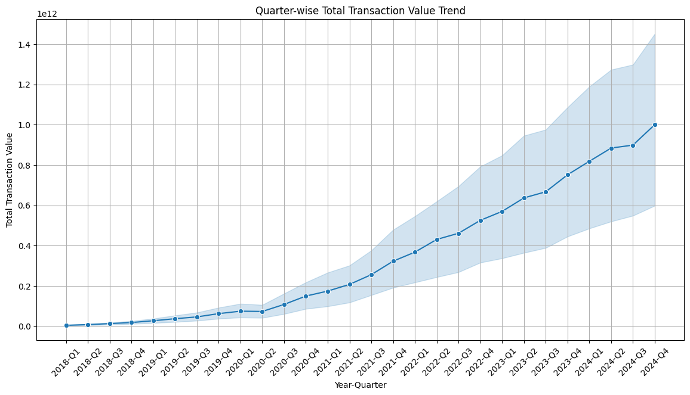
*Statistical distribution of transaction volumes*

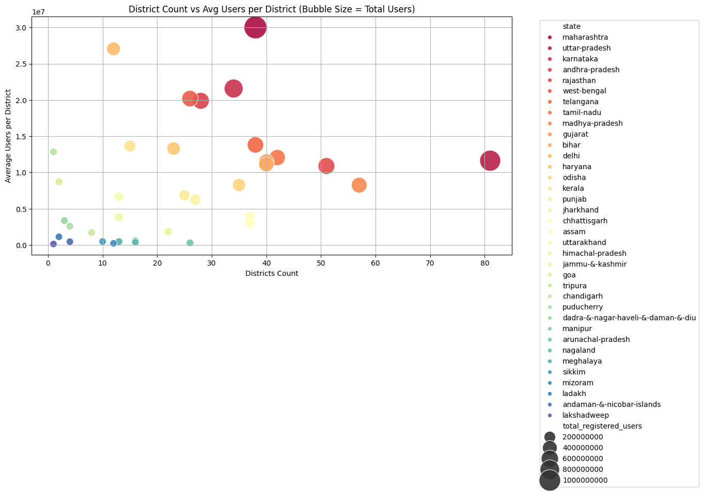
*Correlation analysis between different metrics*

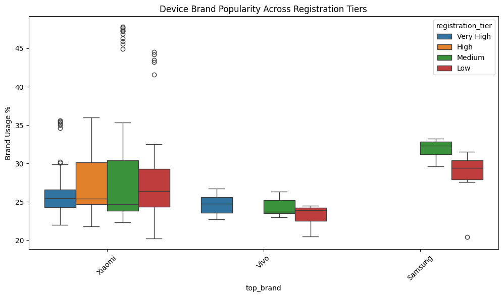
*Statistical analysis of transaction patterns by region*

#### Advanced Analytics

*Machine learning model predictions for transaction trends*


*User segmentation through clustering algorithms*

### Business Case Studies

#### Case Study 1: Urban vs Rural Digital Adoption

*Comparative analysis of digital payment adoption patterns*

#### Case Study 2: Festival Season Impact

*Transaction surge analysis during festival seasons*

#### Case Study 3: Insurance Product Performance

*Insurance product adoption and performance metrics*

#### Case Study 4: Regional Growth Patterns

*Growth pattern analysis across different geographical regions*

#### Case Study 5: Payment Category Trends

*Evolution of different payment categories over time*

### Image Organization Structure

```
images/
│
├── streamlit/
│   ├── main_dashboard.png
│   ├── state_map.png
│   ├── transaction_trends.png
│   ├── category_performance.png
│   ├── top_states.png
│   └── top_districts.png
│
├── powerbi/
│   ├── executive_summary.png
│   ├── geographic_insights.png
│   ├── regional_comparison.png
│   ├── historical_trends.png
│   ├── seasonal_patterns.png
│   └── insurance_analytics.png
│
├── analysis/
│   ├── volume_distribution.png
│   ├── correlation_matrix.png
│   ├── boxplot_analysis.png
│   ├── predictive_model.png
│   └── clustering_analysis.png
│
└── case_studies/
    ├── urban_rural_comparison.png
    ├── festival_impact.png
    ├── insurance_performance.png
    ├── regional_growth.png
    └── category_trends.png
```

> **Note**: All images are high-resolution screenshots and visualizations that demonstrate the analytical capabilities and insights derived from the PhonePe transaction data.

## 🔮 Future Enhancements

- [ ] Real-time data streaming integration
- [ ] Machine learning prediction models
- [ ] Advanced statistical analysis features
- [ ] API development for external integrations
- [ ] Enhanced mobile application features
- [ ] Automated report generation and scheduling

---

**Last Updated**: May 2025  
**Version**: 1.0.0
