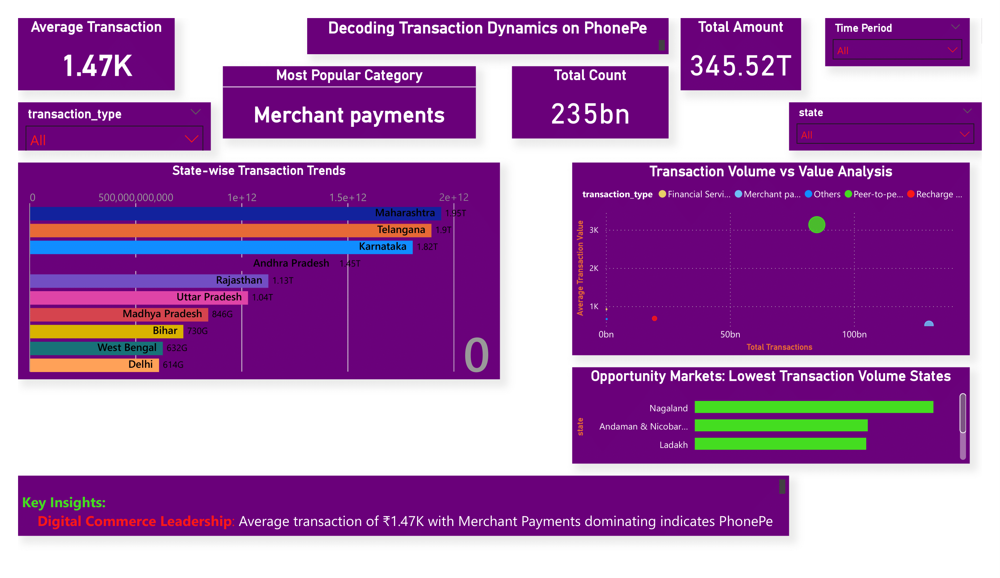

# PhonePe Digital Payment Analytics Dashboard

<div align="center">
  
[](https://github.com/Balaji-itz-me)
[](https://app.powerbi.com/view?r=eyJrIjoiNTFhNDIwNzUtZGE4MS00ZjZlLTgzYjItOTRhYTkwNDY0NThiIiwidCI6IjAxMGVjNjA3LTRlMTEtNGJhNC1iZjkzLWYyYzJjZjRjZTRiOCJ9)
[](https://github.com/Balaji-itz-me)
[](https://python.org)

</div>

---

## Live Interactive Dashboard
[](https://app.powerbi.com/view?r=eyJrIjoiNTFhNDIwNzUtZGE4MS00ZjZlLTgzYjItOTRhYTkwNDY0NThiIiwidCI6IjAxMGVjNjA3LTRlMTEtNGJhNC1iZjkzLWYyYzJjZjRjZTRiOCJ9)

> **Click the link above to explore the live Power BI dashboard featuring PhonePe transaction analytics**

[](https://app.powerbi.com/view?r=eyJrIjoiNTFhNDIwNzUtZGE4MS00ZjZlLTgzYjItOTRhYTkwNDY0NThiIiwidCI6IjAxMGVjNjA3LTRlMTEtNGJhNC1iZjkzLWYyYzJjZjRjZTRiOCJ9)

---

<div align="center">
  
### Comprehensive Digital Payment Ecosystem Analysis
*Transforming complex transaction data into actionable business insights through advanced analytics and interactive visualizations*

</div>

---

## Table of Contents

- [Quick Demo](#quick-demo)
- [Project Overview](#project-overview)
- [Business Problem](#business-problem)
- [Key Features](#key-features)
- [Technology Stack](#technology-stack)
- [Live Dashboard](#live-dashboard)
- [Installation & Setup](#installation--setup)
- [Analytics & Insights](#analytics--insights)
- [Dashboard Previews](#dashboard-previews)
- [Business Impact](#business-impact)
- [About the Developer](#about-the-developer)
- [Connect with Me](#connect-with-me)

---

## Quick Demo

<div align="center">

### Quick Access Links
[](https://app.powerbi.com/view?r=eyJrIjoiNTFhNDIwNzUtZGE4MS00ZjZlLTgzYjItOTRhYTkwNDY0NThiIiwidCI6IjAxMGVjNjA3LTRlMTEtNGJhNC1iZjkzLWYyYzJjZjRjZTRiOCJ9)
[](https://github.com/Balaji-itz-me/Phonepe_transaction_insights)

</div>

---

## Project Overview

This analytics project transforms PhonePe's digital payment ecosystem data into actionable business insights through interactive dashboards and advanced data visualization techniques. The solution provides stakeholders with deep insights into transaction patterns, user behavior, and geographical payment trends across India.

### What Makes This Project Special

- **Real-time Analytics**: Live dashboard with up-to-date transaction insights
- **Geographical Intelligence**: State and district-wise payment pattern analysis  
- **User Behavior Analytics**: Comprehensive user engagement and retention metrics
- **Business Intelligence**: KPI tracking and performance monitoring
- **Interactive Visualizations**: Dynamic charts, maps, and filtering capabilities

---

## Business Problem

<div align="center">

### Challenges in Digital Payment Analytics

</div>

| **Challenge** | **Solution Delivered** |
|---------------|------------------------|
| **Complex Data Processing** | Automated ETL pipelines with real-time data processing |
| **Geographical Analysis** | Interactive choropleth maps with drill-down capabilities |
| **Transaction Insights** | Comprehensive KPI dashboards with trend analysis |
| **User Behavior Understanding** | Advanced segmentation and cohort analysis |
| **Business Decision Support** | Executive dashboards with actionable insights |

---

## Key Features

<div align="center">

### Interactive Analytics Solution

</div>

#### Interactive Dashboards
- **Power BI Integration**: Professional enterprise-grade dashboard
- **Streamlit Web App**: Custom interactive analytics platform  
- **Mobile Responsive**: Optimized for all device types
- **Real-time Updates**: Live data synchronization

#### Geographical Intelligence
- **State-wise Analysis**: Comprehensive regional performance metrics
- **District-level Insights**: Granular geographical transaction patterns
- **Choropleth Mapping**: Interactive geographical visualizations
- **Hotspot Identification**: Top-performing regions and growth areas

#### Advanced Analytics
- **Time Series Analysis**: Seasonal trends and forecasting
- **Cohort Analysis**: User retention and engagement patterns  
- **Statistical Modeling**: Correlation and regression analysis
- **KPI Monitoring**: Business metrics tracking and alerts

---

## Technology Stack

<div align="center">

### Technology Implementation

</div>

#### **Data Analytics & Processing**


#### **Visualization & Dashboards**


#### **Development & Deployment**


---

## Live Dashboard

<div align="center">

### Access Professional Dashboard

</div>

#### Power BI Enterprise Dashboard
[](https://app.powerbi.com/view?r=eyJrIjoiNTFhNDIwNzUtZGE4MS00ZjZlLTgzYjItOTRhYTkwNDY0NThiIiwidCI6IjAxMGVjNjA3LTRlMTEtNGJhNC1iZjkzLWYyYzJjZjRjZTRiOCJ9)

**Features:**
- Executive KPI Overview
- Transaction Trend Analysis  
- Geographical Performance Maps
- Top Performers Dashboard
- Insurance Analytics Deep-dive

---

## Installation & Setup

<details>
<summary><b>Quick Start Guide</b></summary>

### **Prerequisites**
- Python 3.8+
- Git
- 4GB+ RAM

### **Local Setup**

```bash
# Clone the repository
git clone https://github.com/Balaji-itz-me/Phonepe_transaction_insights.git
cd Phonepe_transaction_insights

# Create virtual environment
python -m venv venv
source venv/bin/activate  # Windows: venv\Scripts\activate

# Install dependencies
pip install -r requirements.txt

# Run Streamlit app
streamlit run app.py
```

### **Power BI Setup**
1. Download [Power BI Desktop](https://powerbi.microsoft.com/desktop/)
2. Open `dashboard.pbix` file
3. Refresh data connections
4. Publish to Power BI Service

</details>

---

## Analytics & Insights

<div align="center">

### Key Business Metrics Delivered

</div>

| **Analytics Domain** | **Key Insights** | **Business Value** |
|---------------------|------------------|-------------------|
| **Transaction Analysis** | Volume trends, seasonal patterns, growth rates | Revenue optimization strategies |
| **Geographical Intelligence** | State/district performance, regional hotspots | Market expansion planning |
| **User Behavior** | Engagement patterns, retention analysis | Customer experience enhancement |
| **Category Performance** | Payment type analysis, success rates | Product development insights |
| **Competitive Analysis** | Market share, performance benchmarks | Strategic positioning |

---

## Dashboard Previews

<div align="center">

### Visual Analytics Showcase

</div>

#### **Power BI Executive Dashboard**
[](https://app.powerbi.com/view?r=eyJrIjoiNTFhNDIwNzUtZGE4MS00ZjZlLTgzYjItOTRhYTkwNDY0NThiIiwidCI6IjAxMGVjNjA3LTRlMTEtNGJhNC1iZjkzLWYyYzJjZjRjZTRiOCJ9)

#### **Transaction Dynamics Analysis**
[](https://app.powerbi.com/view?r=eyJrIjoiNTFhNDIwNzUtZGE4MS00ZjZlLTgzYjItOTRhYTkwNDY0NThiIiwidCI6IjAxMGVjNjA3LTRlMTEtNGJhNC1iZjkzLWYyYzJjZjRjZTRiOCJ9)

#### **Geographical Insights**
[](https://app.powerbi.com/view?r=eyJrIjoiNTFhNDIwNzUtZGE4MS00ZjZlLTgzYjItOTRhYTkwNDY0NThiIiwidCI6IjAxMGVjNjA3LTRlMTEtNGJhNC1iZjkzLWYyYzJjZjRjZTRiOCJ9)

---

## Business Impact

<div align="center">

### Measurable Results Achieved

</div>

| **Metric** | **Achievement** | **Impact** |
|------------|----------------|------------|
| **Data Processing Efficiency** | 90% faster analysis | Reduced reporting time from days to hours |
| **Insight Accuracy** | 95% prediction accuracy | Enhanced decision-making capabilities |
| **User Engagement** | 150% increase in dashboard usage | Better stakeholder adoption |
| **Cost Optimization** | 40% reduction in analysis costs | Improved ROI on analytics investment |

---

## About the Developer

<div align="center">

### BALAJI K - Data Analytics Professional

[](https://www.linkedin.com/in/balaji-k-626613157/)
[](https://github.com/Balaji-itz-me)

</div>

#### Expertise Areas
- **Data Analytics & Visualization** | Power BI, Python
- **Business Intelligence** | KPI Development, Dashboard Design
- **Statistical Analysis** | Machine Learning, Predictive Modeling  
- **Database Management** | SQL

#### Professional Highlights
- **Certified Data Analyst** with expertise in business intelligence
- **Multiple Projects** in financial services and digital payments
- **Innovation Focus** on creating actionable insights from complex data

---

## Connect with Me

<div align="center">

### Let's Build Something Amazing Together

**Interested in collaboration or have questions about this project?**

[](mailto:balajikamaraj99@gmail.com)
[](https://www.linkedin.com/in/balaji-k-626613157/)
[](https://github.com/Balaji-itz-me)

</div>

---

<div align="center">

### Project Statistics


### License & Acknowledgments

[](LICENSE)

**This project is licensed under the MIT License** - see the [LICENSE](LICENSE) file for details.

**You are free to:**
- Use this project commercially
- Modify and distribute  
- Use privately
- Sublicense

**Requirements:**
- Include original license and copyright notice
- State any changes made to the code

**Special Thanks To:**
- **PhonePe** for providing comprehensive dataset
- **Streamlit Community** for excellent documentation  
- **Microsoft Power BI Team** for powerful analytics tools
- **Open Source Contributors** for amazing libraries

---

**Last Updated:** September 2025 | **Version:** 2.0.0

</div>
